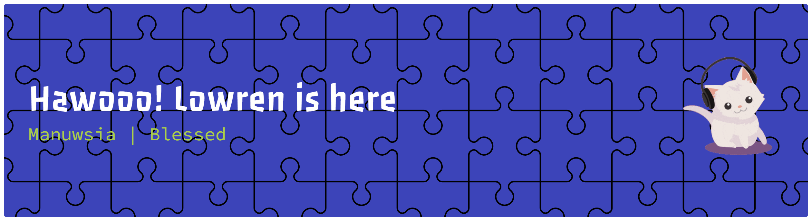

## Hi there 👋

### 👨‍💻 About Me
I'm a Front-End Developer and Information Systems graduate with a passion for blending clean code with solid business strategy. I love creating intuitive UI/UX and building platforms that solve real-world problems.

- 🔭 **Currently working on:** Developing the core Trainer feature for the idSpora Learning Management System (LMS) using Laravel.
- 🌱 **Currently learning:** Deepening my TypeScript skills and preparing for my BSc in Business Information Systems at the University of Westminster!
- 👯 **Open to collaborate on:** Edutech platforms, social innovation startups, and engaging front-end web projects. 
- 💬 **Ask me about:** HTML/CSS/JS, Laravel, UI/UX design in Figma, or structuring a startup business proposal.
- 😄 **Pronouns:** He/Him *(silakan sesuaikan)*

### 🛠️ Tech Stack & Tools

  
  
  
  
  
  
  

### 📈 GitHub Activity
<picture>
  <source media="(prefers-color-scheme: dark)" srcset="https://raw.githubusercontent.com/marbor12/marbor12/output/pacman-contribution-graph-dark.svg">
  <source media="(prefers-color-scheme: light)" srcset="https://raw.githubusercontent.com/marbor12/marbor12/output/pacman-contribution-graph.svg">
  
</picture>

### 📫 Let's Connect!
You can call or text me (my number is still the same!), or reach out through my professional networks:

